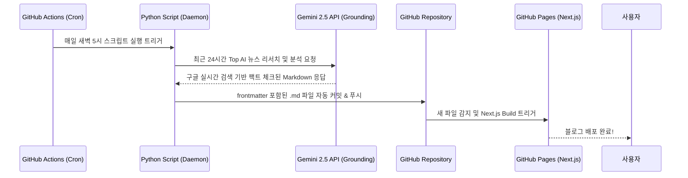

하루가 멀다 하고 쏟아지는 AI와 마케팅 트렌드. 실무자로서 매일 해외 아티클을 읽고 분석해서 블로그에 정리하는 것은 생각보다 엄청난 시간과 에너지를 요구합니다. 

그래서 저는 결심했습니다. **"내가 자는 동안 AI가 알아서 전 세계 뉴스를 읽고, 분석하고, 내 블로그에 포스팅까지 완료하게 만들 수는 없을까?"**

이 글에서는 별도의 서버 비용 없이 **GitHub Actions**, **Next.js**, 그리고 **Gemini 2.5 Flash (Search Grounding)**를 활용하여 100% 자동으로 굴러가는 **무인 AI 블로그 파이프라인**을 구축한 과정을 공유합니다.

---

## 🏗️ 전체 아키텍처 개요 (Zero-Cost Pipeline)

비싼 클라우드 서버나 복잡한 인프라 대신, 개발자들에게 친숙한 도구들을 조합하여 '비용 0원'의 완전 자동화 환경을 구성했습니다.



> [!TIP]
> **핵심 포인트**: 서버를 띄워둘 필요 없이 GitHub Actions의 `cron` 스케줄러를 통해 정해진 시간에만 워커가 깨어나 작업을 수행하고 종료됩니다.

---

## 🛠️ 핵심 기술 스택 및 구현 방법

### 1. Gemini 2.5 Flash + Google Search Grounding
가장 큰 고민은 AI의 고질적인 병인 **'할루시네이션(환각)'**이었습니다. 없는 뉴스를 지어내거나 날짜를 헷갈리면 블로그의 신뢰도가 바닥을 치기 때문입니다.

이를 해결하기 위해 **Gemini API의 Google Search Grounding** 기능을 도입했습니다. 

```python
# 실제 파이프라인에 사용된 코드 스니펫
payload = {
    "contents": [{"parts": [{"text": prompt}]}],
    "tools": [{"googleSearch": {}}], # 구글 실시간 검색 강제 활성화
    "generationConfig": {
        "temperature": 0.4
    }
}
```

이 옵션을 켜면 Gemini는 자체 뇌피셜로 글을 쓰지 않고, 실시간 구글 검색(Hacker News, TechCrunch 등)을 수행한 뒤 그 **팩트에 기반해서만** 답변을 생성합니다. 심지어 마크다운 주석(`[^1]`) 형태로 원문 링크(Citation)까지 완벽하게 달아줍니다.

*(여기에 Gemini가 리서치 결과를 정리한 터미널 실행 화면 캡처 삽입)*
``

### 2. 정교한 프롬프트 엔지니어링 (CMS 표준화)
AI가 글을 쓸 때마다 양식이 바뀌면 Next.js 블로그에서 렌더링 에러가 발생합니다. 이를 막기 위해 매우 엄격한 프롬프트 가이드라인을 설정했습니다.

*   **Frontmatter 강제**: `title`, `date`, `category`, `excerpt` 등 블로그 시스템이 요구하는 YAML 메타데이터를 첫 줄에 정확히 출력하도록 지시.
*   **어조(Tone & Manner)**: '해요체'를 금지하고, 테크 저널과 같은 전문적인 문어체(~이다, ~한다)를 사용하도록 강제.
*   **구조화된 출력**: 단순히 글만 쓰는 것이 아니라, 'Top 3 심층 분석'과 'Top 10 뉴스 중요도 평가 테이블(표)'을 마크다운 문법으로 완벽히 렌더링하도록 세팅.

### 3. GitHub Actions를 통한 완전 자동화 연동
파이썬 스크립트가 완성된 후, 이를 매일 자동으로 실행해 줄 일꾼이 필요했습니다. `.github/workflows/gemini_daily_research.yml` 파일을 생성하여 다음과 같이 세팅했습니다.

```yaml
on:
  schedule:
    - cron: '0 20 * * *' # 한국 시간 매일 오전 5시 실행

jobs:
  research-and-post:
    # ... (환경 세팅 생략) ...
    steps:
      - name: Run Auto Blogger
        env:
          GEMINI_API_KEY: ${{ secrets.GEMINI_API_KEY }}
        run: python scripts/gf2_auto_blogger.py

      - name: Commit and Push
        run: |
          git add content/posts/2.\ AI\ News/*.md
          git commit -m "auto: Gemini deep research post generated"
          git push
```

*(여기에 GitHub Actions에서 초록색 체크마크가 뜬 성공 워크플로우 캡처 삽입)*
``

파이프라인이 `.md` 파일을 레포지토리에 푸시하면, 이를 감지한 또 다른 Actions 워크플로우(`nextjs.yml`)가 즉시 Next.js 정적 빌드를 수행하고 GitHub Pages에 새 글을 라이브로 배포합니다.

---

## 🎯 도입 후기: 진짜 '자면서 일하는 기분'

이 파이프라인을 구축한 뒤 제 아침 루틴이 완전히 바뀌었습니다. 
눈을 뜨고 침대에서 스마트폰으로 제 블로그에 접속하면, 간밤에 미국에서 터진 굵직한 AI 이슈들이 **전문가의 심층 리포트 형태**로 깔끔하게 정리되어 올라와 있습니다. 

> [!IMPORTANT]
> 이 시스템의 진정한 가치는 **'시간의 해방'**입니다. 저는 이제 뉴스 검색과 요약에 시간을 쏟는 대신, AI가 정리해 준 팩트를 바탕으로 저만의 인사이트를 덧붙이거나 더 깊은 차원의 업무에 집중할 수 있게 되었습니다.

앞으로는 이 시스템을 더욱 고도화하여, 제가 흥미를 가지는 특정 논문(Paper)이나 기술 키워드에 대해서만 더 깊게 파고드는 개인 맞춤형 리서치 에이전트로 발전시켜 볼 계획입니다.

**여러분의 자동화 프로젝트에는 어떤 AI를 활용하고 계신가요? 재미있는 아이디어가 있다면 공유해 주세요!**
